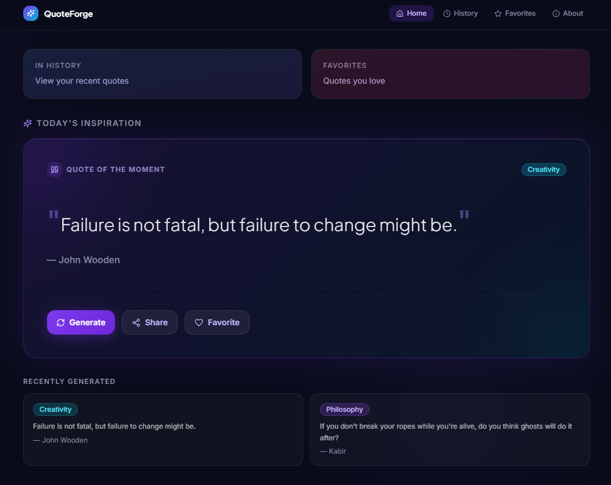
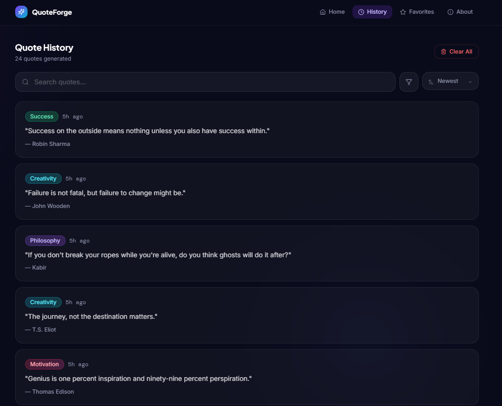
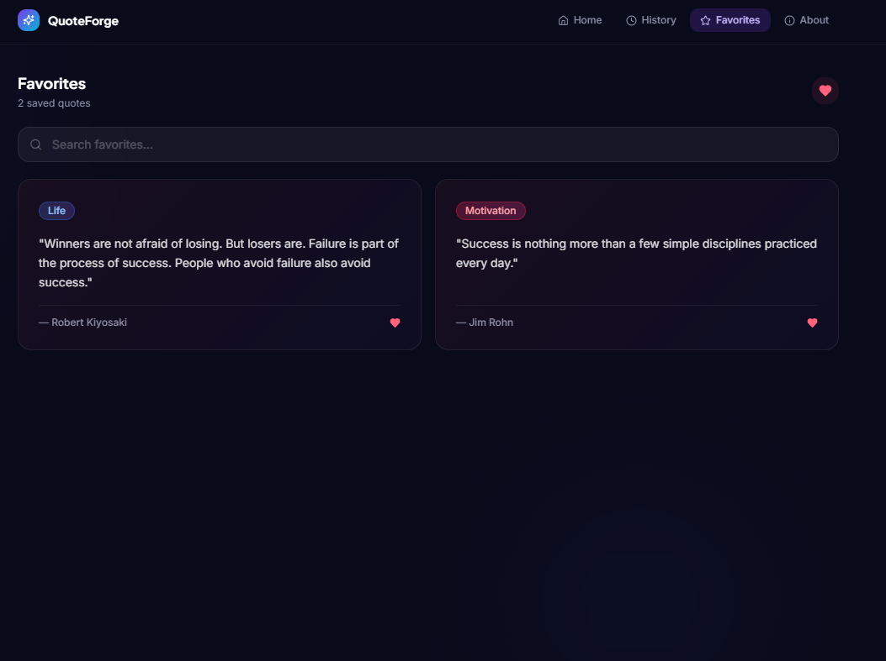

# 📖 Quote Generator

A full-stack Quote Generator website built with **React**, **Flask**, and **SQLite**. The website fetches random inspirational quotes from an external API, displays them in a clean and responsive interface, and stores each generated quote in a SQLite database for history and favorites management.

---

## ✨ Features

- 🎲 Generate random quotes from an external API
- 💾 Automatically save generated quotes to a SQLite database
- 📜 View quote history
- ⭐ Mark quotes as favorites
- 📋 Copy quotes to the clipboard
- ⚡ Responsive and modern user interface
- 🔄 REST API integration between frontend and backend

---

## 🛠️ Tech Stack

### Frontend

- React
- TypeScript
- Vite
- CSS

### Backend

- Flask
- Flask-CORS
- Flask-SQLAlchemy
- SQLAlchemy

### Database

- SQLite

### External API

- ZenQuotes API

---

## 📂 Project Structure

```text
Quote-Generator/
│
├── backend/
│   ├── app.py
│   ├── config.py
│   ├── models.py
│   ├── requirements.txt
│   └── instance/
│
├── frontend/
│   ├── src/
│   │   ├── app/
│   │   ├── components/
│   │   ├── api.ts
│   │   └── main.tsx
│   ├── package.json
│   └── vite.config.ts
│
├── .gitignore
└── README.md
```

---

## 🚀 Getting Started

### 1. Clone the repository

```bash
git clone https://github.com/Dbarsha-hub/Quote_Generator.git
cd Quote_Generator
```

---

### 2. Backend Setup

Navigate to the backend folder.

```bash
cd backend
```

Create a virtual environment.

```bash
python -m venv venv
```

Activate the virtual environment.

**Windows**

```bash
venv\Scripts\activate
```

**Linux/macOS**

```bash
source venv/bin/activate
```

Install dependencies.

```bash
pip install -r requirements.txt
```

Run the Flask server.

```bash
python app.py
```

---

### 3. Frontend Setup

Open another terminal.

```bash
cd frontend
```

Install dependencies.

```bash
npm install
```

Start the development server.

```bash
npm run dev
```

---

## 🔌 API Endpoints

| Method | Endpoint            | Description              |
| ------ | ------------------- | ------------------------ |
| GET    | `/api/quote`        | Generate a random quote  |
| GET    | `/api/history`      | Retrieve quote history   |
| POST   | `/api/favorite/:id` | Mark a quote as favorite |
| GET    | `/api/favorites`    | Retrieve favorite quotes |

---

## 📸 Screenshots

### Home Page



### Quote History



### Favorites



---

## 👩‍💻 Author

**Barsha Priyadarshini Das**
